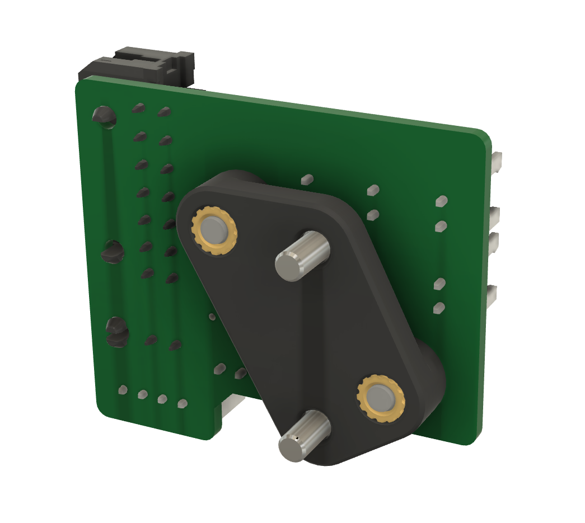

# LGX Lite toolhead PCB mount
Use with Mrgl-Mrgl's LGX Lite and cable chain mounts https://github.com/Mrgl-Mrgl/VoronUsers/tree/master/printer_mods/Mrgl-Mrgl/LGX_Lite_Mount

## Fasteners
- 2 x M3x5x4 threaded inserts
- 2 x M3x8 countersunk socket head screws for mount to LGX Lite body
- 2 x M3x8 socket head cap screws
- 2 x M3 plastic washers

