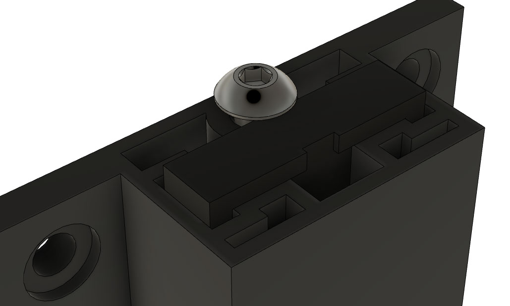

# 6-pin Microfit 2020 holder

Intended to be used as a place to plug in an ADXL345 cable inside the enclosure

- this is a work-in-progress
- based on https://github.com/alchemyEngine/EnragedRabbitProject/tree/main/usermods/Skirt-Microfit-Inserts
- secure from below with a M3 button head screw

