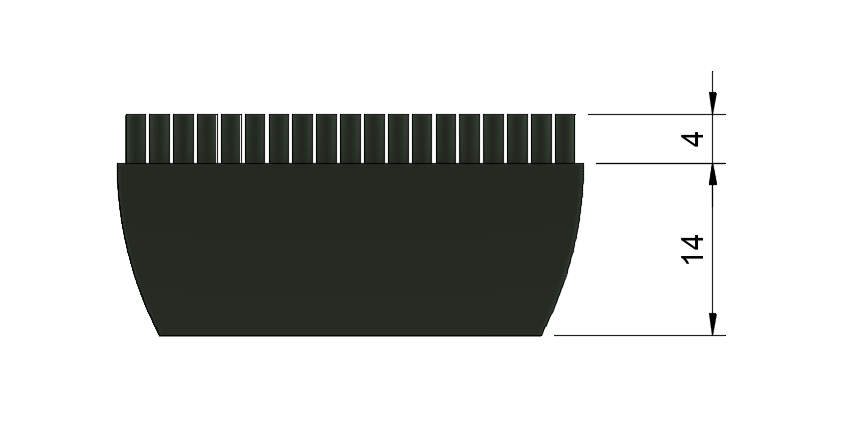
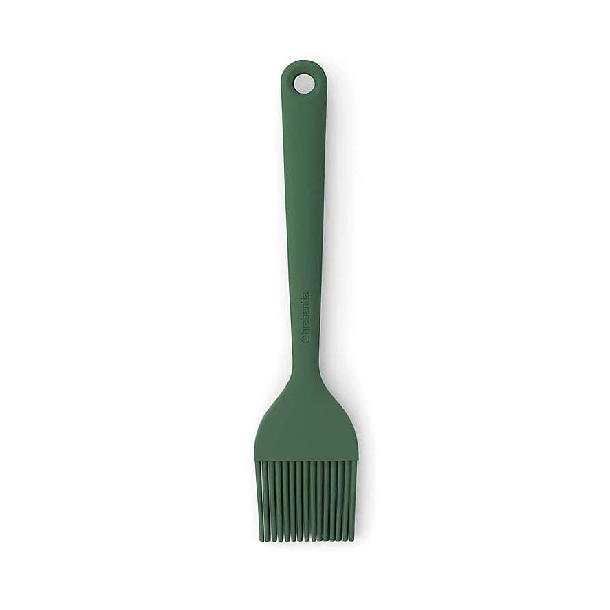
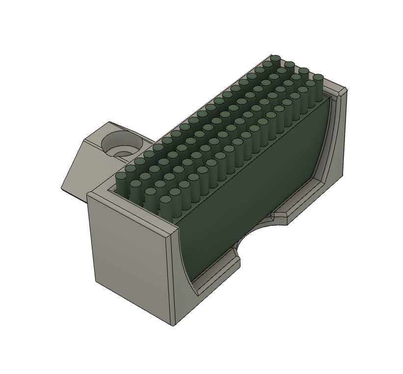
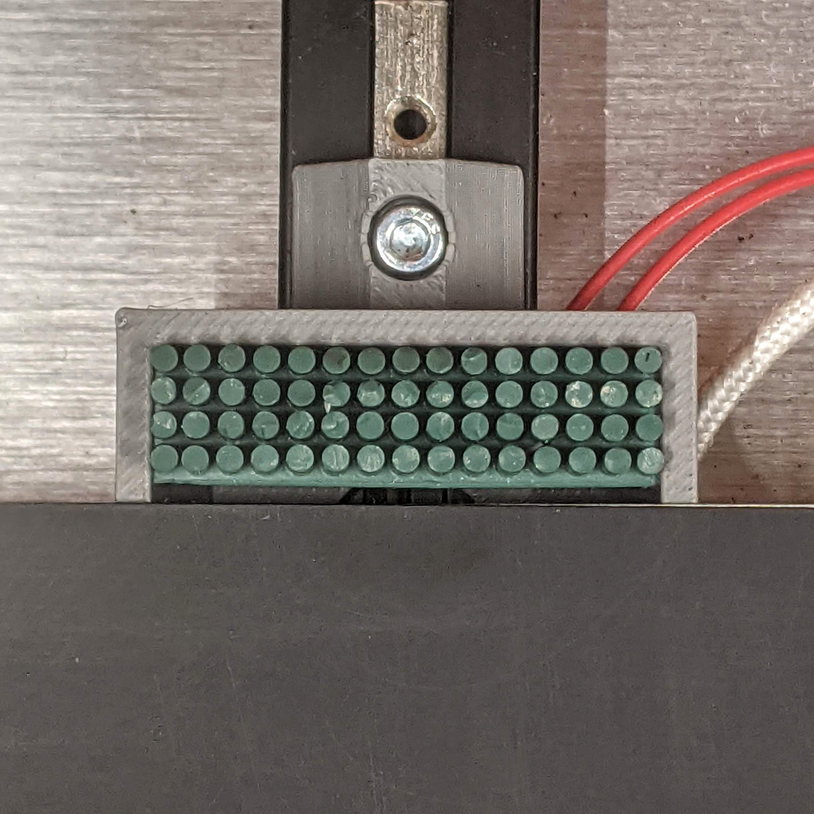

# Silicone brush holder

- brush from https://www.dunelm.com/product/brabantia-tasty-green-pastry-brush-1000165707 and other 3D printer suppliers
- cut the body to 14mm and bristles to about 4mm
- adjust brush variables in nozzle_scrub.cfg if necessary

