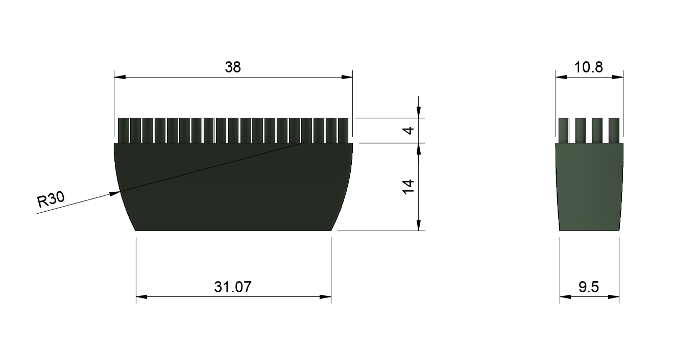

# Silicone brush holder

For https://github.com/VoronDesign/VoronUsers/tree/master/printer_mods/edwardyeeks/Decontaminator_Purge_Bucket_&_Nozzle_Scrubber

This is a work-in-progress; dimensions are approximate

- this is the brush: https://www.dunelm.com/product/brabantia-tasty-green-pastry-brush-1000165707
- the body is cut to 14mm and the bristles to about 4mm
- adjust brush variables in nozzle_scrub.cfg if necessary

## A video
https://www.youtube.com/watch?v=X0o17m9FSyQ
