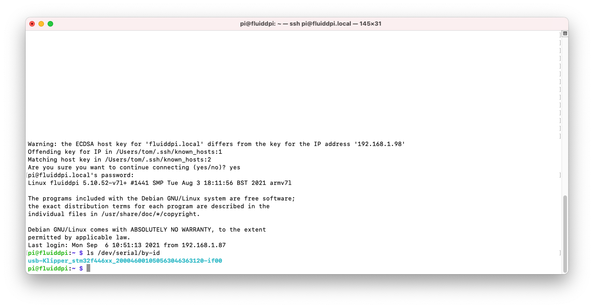

Installing Klipper firmware on the Spider
===

Installing firmware for the first time (instructions by 2be2d#9944 on Discord)
---

<https://discord.com/channels/460117602945990666/822468097637875712/866018513440342066>

- Spider is powered with 24V and connected to Pi via USB.
- power off the Spider, remove SD Card, place jumper between BT0 and 3.3V
- power up Spider
- run:
```
dfu-util --list
```
 should look something like:
 
- remove jumper
- run the following commands:
```
cd ~/klipper
make menuconfig
```
Set all the settings as shown:

- run the following commands:
```
make clean
make
wget https://github.com/FYSETC/FYSETC-SPIDER/raw/main/bootloader/Bootloader_FYSETC_SPIDER.hex
objcopy --input-target=ihex --output-target=binary Bootloader_FYSETC_SPIDER.hex Bootloader_FYSETC_SPIDER.bin && dfu-util -a 0 -s 0x08000000:mass-erase:force -D Bootloader_FYSETC_SPIDER.bin
dfu-util -R -a 0 -s 0x08008000:leave -D out/klipper.bin
```
- power off the Spider, remove jumper on BT0 and 3.3V
- power Spider on and run:
```
ls /dev/serial/by-id
```
- if the firmware flash was successful, should see a valid ID (and not one containing 'marlin')


Updating firmware
---
Will need to run `make menuconfig` and use the settings from above
- run the following commands:
```
cd ~/klipper
make clean
make
sudo service klipper stop
make flash FLASH_DEVICE=/dev/serial/by-id/usb-Klipper_stm32f446xx_200046001050563046363120-if00
sudo service klipper start
```
